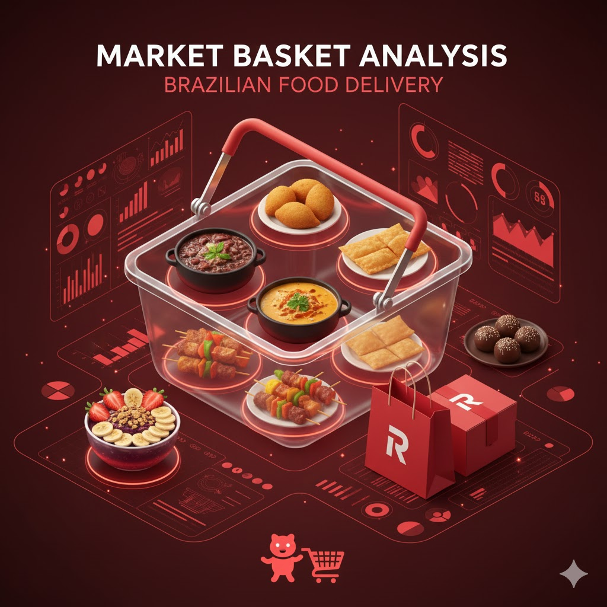

  

# Market Basket Analysis (MBA)
**Overview**

This repository contains a Market Basket Analysis (MBA) performed on synthetic transactional data to uncover association rules, purchase patterns, and actionable insights for cross-selling and upselling strategies.

The analysis applies the Apriori algorithm and evaluates rules using Support, Confidence, and Lift, translating statistical outputs into business-oriented recommendations.

**Objectives**

- Identify products frequently purchased together
- Detect items that act as upsell or cross-sell triggers
- Quantify the strength of associations beyond random chance
- Provide actionable insights applicable to pricing, promotions, and menu design

**Dataset Description**

The dataset consists of synthetic transactional-level purchase data, where each row represents an item purchased within a transaction.

Typical structure:

ID_Transacao
Item
Valor_Item        
Data
Hora

Each transaction may contain one or multiple items.

## Methodology
1. Data Preparation

- Group items by transaction
- Transform transactions into a one-hot encoded basket format

2. Association Rule Mining

- Algorithm: Apriori
- Output: frequent itemsets and association rules

3. Metrics Used

**Support**

Measures how frequently an itemset appears in the dataset.

Example:

Support = 0.113 → 11.3% of all transactions contain this combination

**Confidence**

Measures the conditional probability of buying the consequent given the antecedent.

Example:

Coxinha → Guaraná = 0.60 means that 60% of customers who bought Coxinha also bought Guaraná.

**Lift**

Measures how much stronger the association is compared to random chance.

Lift > 1 → meaningful association
Lift ≈ 3 → very strong association
Lift ≥ 4 → near-standard customer behavior

## Key Findings
**Rule 1**

Caipirinha de Limão → Feijoada Completa

support = 0.2336
confidence = 0.717
lift = 1.93

*Interpretation*

~23% of all transactions include both items
Customers who buy Caipirinha also buy Feijoada in ~72% of cases
The association is nearly 2x stronger than random chance

*Actionable Insight*

Caipirinha acts as a strong upsell trigger for Feijoada.
Ideal for waiter recommendations, highlighted pairings on the menu,
combo or bundle offerings.

**Rule 2**

Prato Feito (PF) → Pudim de Leite

support = 0.193989
confidence = 0.54
lift = 1.84

- ~19% of all transactions include both items
- More than half of PF buyers choose Pudim as dessert
- Indicates a routine, non-gourmet meal pattern
- PF customers show high propensity for simple desserts

*Actionable Insight*

- Automatically suggest dessert at checkout
- Offer PF + Pudim combos
- Low-friction strategy to increase average ticket size

## Visualization

The analysis includes:

- Heatmaps of association strength
- Ranked tables of top rules by Lift and Confidence
- These visualizations help identify:
- Strongest product pairings

## Business Implications ##

Certain products function as anchors, increasing likelihood of additional purchases

*MBA insights can inform:*

- Promotion and bundling strategies
- Sales staff training
- Menu layout optimization
- Results show consistent behavioral patterns rather than random correlations

## Next Steps ##

*Potential extensions of this analysis include:*

- Time-based segmentation (lunch vs dinner vs happy hour)
- Margin-aware rule prioritization
- A/B testing suggested bundles
- Integration with customer segmentation models

## Tech Stack

- Python
- pandas
- mlxtend
- seaborn / matplotlib

## License

This project is for educational and analytical purposes.